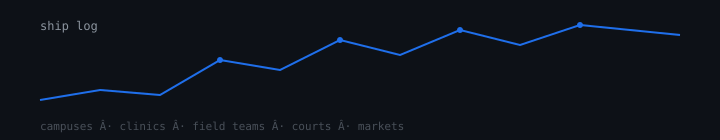

# Shadrack Baraka Mwahanga

Law student at Kabarak University. I build offline AI and legal tech for East Africa.

## Research in a Stick (RIS)

Team leader. USB offline research workstation: local LLMs, document RAG, citation engine, Kiswahili support. No cloud. No install. Built for CRIW 2026.

## Selected work

| Project | Domain |
| --- | --- |
| [Juriscore](https://github.com/shadrackb1/juriscore) | Legal research |
| [Know Your Rights](https://github.com/shadrackb1/know-your-rights) | Legal literacy |
| [Law Beyond](https://github.com/shadrackb1/law-beyond) | Study systems |
| [KSAS](https://github.com/shadrackb1/KSAS) | Campus attendance |
| [USSD Attendance](https://github.com/shadrackb1/ussd-attendance) | Feature-phone check-in |
| [EFK Battles](https://github.com/shadrackb1/efk-battles) | Tournaments + M-Pesa |
| [Mingle](https://github.com/shadrackb1/mingle-app) | Matchmaking |
| [Foursons FieldOps](https://github.com/shadrackb1/foursons-fieldops) | Field operations |
| [CareConnect](https://github.com/shadrackb1/careconnect1) | Care coordination |
| [OBOMOCARE](https://github.com/shadrackb1/obomocare-live) | Community platform |

## Credentials

LLB, Kabarak University. 24 AI certifications including 15 from Anthropic Claude Academy. Robotics workshop organizer on campus.

## Contact

shadrackb@kabarak.ac.ke · [LinkedIn](https://www.linkedin.com/in/shadrackbaraka) · [GitHub](https://github.com/shadrackb1)
